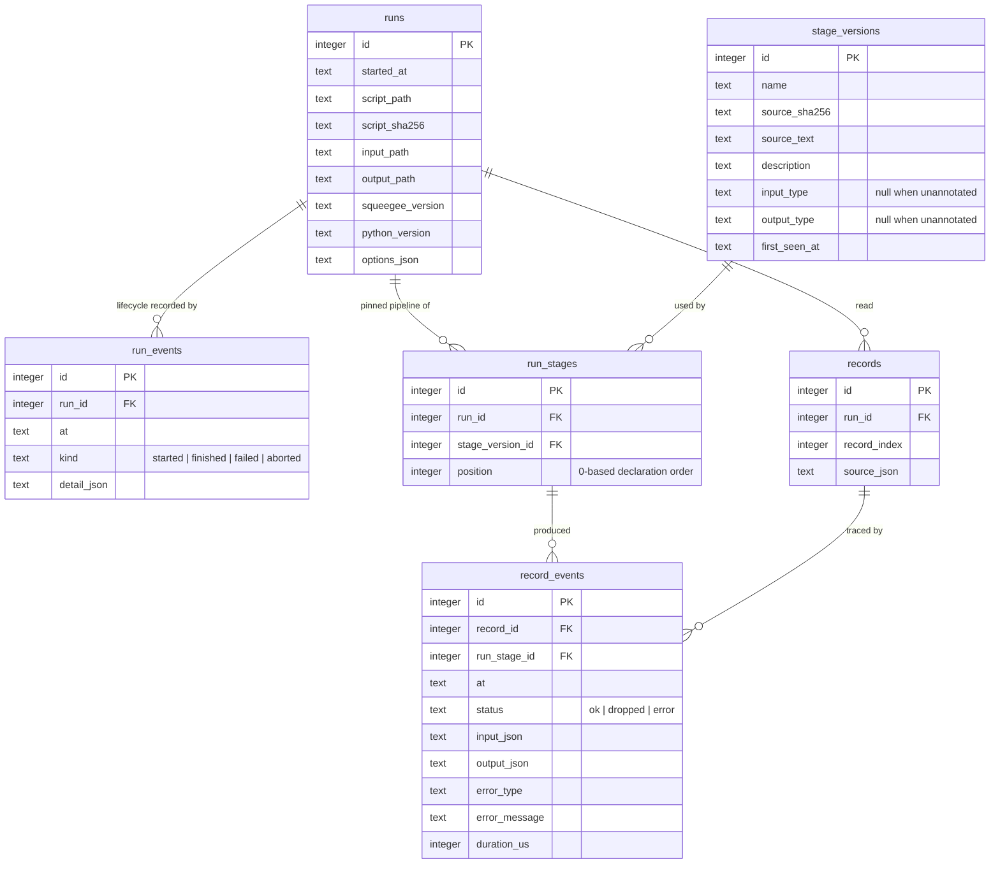

# Data Model

## Principles

1. **Append-only.** Every write is an `INSERT`. Nothing is ever updated or deleted, including by mistake, including by a future version of Squeegee. This is enforced by SQLite triggers, not by convention.
2. **Self-contained.** The database stores the source text of each stage, so a run can be reviewed without the original script.
3. **Local.** One SQLite file, by default `.squeegee/squeegee.db` relative to the script being run.
4. **Readable during writes.** WAL mode, so the UI can read while a run is in progress.
5. **Durable enough.** `synchronous=NORMAL`, the usual companion to WAL, so a commit does not wait on fsync. The exposure is losing the most recent commits to a power cut, never to a crash of Squeegee itself, and this is a debugging record rather than a ledger. With `FULL` a ten thousand record run takes roughly three times as long.

## The append-only exception

A run needs an end timestamp and final counts, which naively means updating the `runs` row. Squeegee does not do that. Instead, run lifecycle is recorded as events in `run_events`, and the current state of a run is a view over those events. The same rule applies anywhere else a status would otherwise be mutated.

## Entity relationship diagram



### How the diagram answers the hard cases

**Many stages in one pipeline.** `run_stages` is the pipeline as it existed for one run: one row per stage, ordered by `position`. The pipeline is not stored on the script or on the stage; it is stored per run, because the script can change between runs.

**The same stage across many runs.** `stage_versions` is keyed by name plus source hash and is shared across runs. A stage nobody has edited resolves to the same `stage_versions` row for every run that used it, so the UI can ask "show me every run of `parse_amount` as it is written today" and get an honest answer.

**An edited stage.** Editing the body changes the source hash, which inserts a new `stage_versions` row. Old `run_stages` rows keep pointing at the old version with its old source text. Nothing is rewritten, so a historical run always renders the code that actually produced its values.

**A reordered or removed stage.** Order lives in `run_stages.position`, not in `stage_versions`, so reordering stages between runs changes only the new run's rows. Deleting a stage from the script simply means no new `run_stages` row references it; its history stays intact.

**One record through the whole pipeline.** `records` is the record as it was read from the input. Every step it took is a `record_events` row joining that record to a `run_stage`. The UI's record trace is one query: events for a record, ordered by the position of their run stage. The record's value after stage N is `output_json`; a trace ends early when a status is `dropped` or `error`.

**Comparing two runs.** Two runs that used the same `stage_versions` rows are directly comparable stage by stage. Where their `stage_versions` differ, the UI can show exactly which stage's source changed between them.

## Schema

```sql
CREATE TABLE runs (
    id                INTEGER PRIMARY KEY,
    started_at        TEXT    NOT NULL,          -- ISO 8601 UTC
    script_path       TEXT    NOT NULL,
    script_sha256     TEXT    NOT NULL,          -- whole script, for provenance
    input_path        TEXT    NOT NULL,
    output_path       TEXT,
    squeegee_version  TEXT    NOT NULL,
    python_version    TEXT    NOT NULL,
    options_json      TEXT    NOT NULL           -- CLI flags as given, for reproducibility
);

CREATE TABLE run_events (
    id          INTEGER PRIMARY KEY,
    run_id      INTEGER NOT NULL REFERENCES runs(id),
    at          TEXT    NOT NULL,
    kind        TEXT    NOT NULL CHECK (kind IN ('started', 'finished', 'failed', 'aborted')),
    detail_json TEXT                             -- final counts, error message
);

CREATE TABLE stage_versions (
    id            INTEGER PRIMARY KEY,
    name          TEXT NOT NULL,
    source_sha256 TEXT NOT NULL,
    source_text   TEXT NOT NULL,
    description   TEXT,
    input_type    TEXT,                          -- annotation as text, NULL when the user did not annotate
    output_type   TEXT,
    first_seen_at TEXT NOT NULL,
    UNIQUE (name, source_sha256)
);

CREATE TABLE run_stages (
    id                INTEGER PRIMARY KEY,
    run_id            INTEGER NOT NULL REFERENCES runs(id),
    stage_version_id  INTEGER NOT NULL REFERENCES stage_versions(id),
    position          INTEGER NOT NULL,          -- 0-based declaration order
    UNIQUE (run_id, position)
);

CREATE TABLE records (
    id           INTEGER PRIMARY KEY,
    run_id       INTEGER NOT NULL REFERENCES runs(id),
    record_index INTEGER NOT NULL,               -- 0-based position in the input
    source_json  TEXT    NOT NULL,               -- the record as read, before any stage
    UNIQUE (run_id, record_index)
);

CREATE TABLE record_events (
    id            INTEGER PRIMARY KEY,
    record_id     INTEGER NOT NULL REFERENCES records(id),
    run_stage_id  INTEGER NOT NULL REFERENCES run_stages(id),
    at            TEXT    NOT NULL,
    status        TEXT    NOT NULL CHECK (status IN ('ok', 'dropped', 'error')),
    input_json    TEXT    NOT NULL,
    output_json   TEXT,                          -- NULL when dropped or errored
    error_type    TEXT,
    error_message TEXT,
    duration_us   INTEGER NOT NULL
);

CREATE INDEX idx_records_run       ON records (run_id, record_index);
CREATE INDEX idx_events_record     ON record_events (record_id);
CREATE INDEX idx_events_stage      ON record_events (run_stage_id, status);
```

### Immutability triggers

Every table gets the same pair. Written out once here; the implementation generates them for each table.

```sql
CREATE TRIGGER records_no_update BEFORE UPDATE ON records
BEGIN SELECT RAISE(ABORT, 'squeegee tables are append-only'); END;

CREATE TRIGGER records_no_delete BEFORE DELETE ON records
BEGIN SELECT RAISE(ABORT, 'squeegee tables are append-only'); END;
```

### Views

```sql
-- current state of every run, derived from run_events rather than stored
CREATE VIEW run_status AS
SELECT r.id AS run_id,
       r.started_at,
       (SELECT e.at   FROM run_events e WHERE e.run_id = r.id AND e.kind != 'started' ORDER BY e.id DESC LIMIT 1) AS ended_at,
       COALESCE((SELECT e.kind FROM run_events e WHERE e.run_id = r.id ORDER BY e.id DESC LIMIT 1), 'started')   AS status
FROM runs r;
```

The UI's per-stage counts come from aggregates over `record_events` grouped by `run_stage_id` and `status`. No counts are cached in v1; if that becomes slow, the cache belongs in a separate derived table that can be dropped and rebuilt, never in these tables.

## Value storage

Record values are stored as JSON text. This keeps the database engine-neutral, human-readable, and queryable through SQLite's JSON1 functions, which is what the UI's field statistics use:

```sql
SELECT AVG(json_extract(output_json, '$.amount_cents'))
FROM record_events WHERE run_stage_id = ? AND status = 'ok';
```

Values that are not JSON-serializable are stored as their `repr()` wrapped in a marker object, and the event is still recorded. Losing observability is worse than losing fidelity on an exotic value.

## Growth and retention

A run of N records through S stages writes N rows to `records` and up to N×S rows to `record_events`. Ten thousand records through five stages is roughly fifty thousand event rows, which SQLite handles without trouble.

Because the tables are append-only, the only way to reclaim space is to delete the database file, or to run `squeegee prune --before DATE`, which is defined as: copy the runs worth keeping into a fresh database file and swap it in. Pruning is out of scope for v1 but the design must not preclude it.
